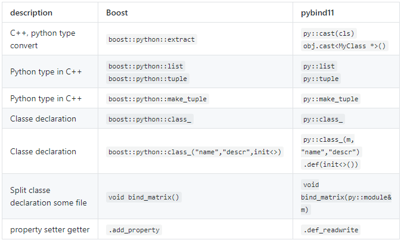

# Call A from B and (hopefully) vice versa

There will be no Glory programming language, no matter it is C, C++, Java, Python, JS or PHP? And from time to time, we always need to call A from B, like call C++ library from python to embrace his speed and her neatness. So, here it is, a guidance to do the magic (Copy & Paste from various places).

## C++ and python

* [TNG/boost-python-examples](https://github.com/TNG/boost-python-examples)
* [MiaoDX-fork-and-pruning/pybind-python-examples](https://github.com/MiaoDX-fork-and-pruning/pybind-python-examples), migrate to pybind11.

There are some tools for integrating C++ and python, like `ctypes`, `SWIG`, `Cython`, `Boost.python` and [some other ones](https://wiki.python.org/moin/IntegratingPythonWithOtherLanguages). In many mature libraries, the python binding is provided by Boost.python, however, Boost.python itself is somewhat heavy and not so easy to install, so, pybind11 is one attractive replacement, like [dlib](https://github.com/davisking/dlib/issues/293), [NuPic](https://discourse.numenta.org/t/proposal-to-introduce-pybind-for-move-toward-python-3-compatibility/3110) adopt it.

It is a little annoying if the only advantage of pybind11 compared with Boost.python is just light-weight, since chances are that the boost community can make things much easier latter. But pybind11 itself is really good maintained and documented, so, it still can be appealing.

As given in [dlib discussion](https://github.com/davisking/dlib/issues/293), the pybind seems can be ported from boost.python with not much effort:



### Other differences between Boost.python and pybind

* `& or not`

``` cpp
char const* greet()
{
   return "hello, world";
}

#include <pybind11/pybind11.h>

PYBIND11_MODULE(hello, m)
{
    m.def("greet", &greet);
    m.def ( "greet2", greet );
}
```

Both the greet and greet2 can be called, what are the differences?

* pybind must has `init` method

``` cpp
// boost.python
using namespace boost::python;
class_<World>("World")
    .def("greet", &World::greet)
;

// pybind
namespace py = pybind11;
py::class_<World> (m, "World" )
    .def ( py::init<> () ) // THIS IS MUST
    .def ( "greet", &World::greet )
;
```

* `init` formats, pybind can only be listed below

``` cpp
// boost.python
class_<Ctor>("Ctor", init<std::string>())
    .def(init<double, double>())

// pybind
py::class_<Ctor> (m, "Ctor")// `py::init<std::string>()` can not be here
    .def(py::init<std::string> () )
    .def(py::init<double, double>())
```

* `add_property` -> `def_property`

The above picture is a little wrong, the `add_property` changed into `def_property` in pybind, and `def_readwrite` is the same as defined both `getter` and `setter`

``` cpp
.def_readwrite("name", & SomeClass::name)
.def_property ("number", &SomeClass::getNumber, &SomeClass::setNumber )  
```

* no need of special care of return objects

``` cpp
Base* factory()
{
    return new Derived;
}

def ( "factory", factory, py::return_value_policy<manage_new_object> () ); // boost.python
m.def ( "factory", factory); // pybind
```

* virtual functions

``` cpp
// NOTE the sequence of Base and BaseWrap, it is odd ..
py::class_<Base, BaseWrap > ( m, "Base" )
    .def ( py::init<> () )
    .def("name", &Base::name)
    ;
```

The derived class is after base class when there are virtual functions needed to be implemented in python code.